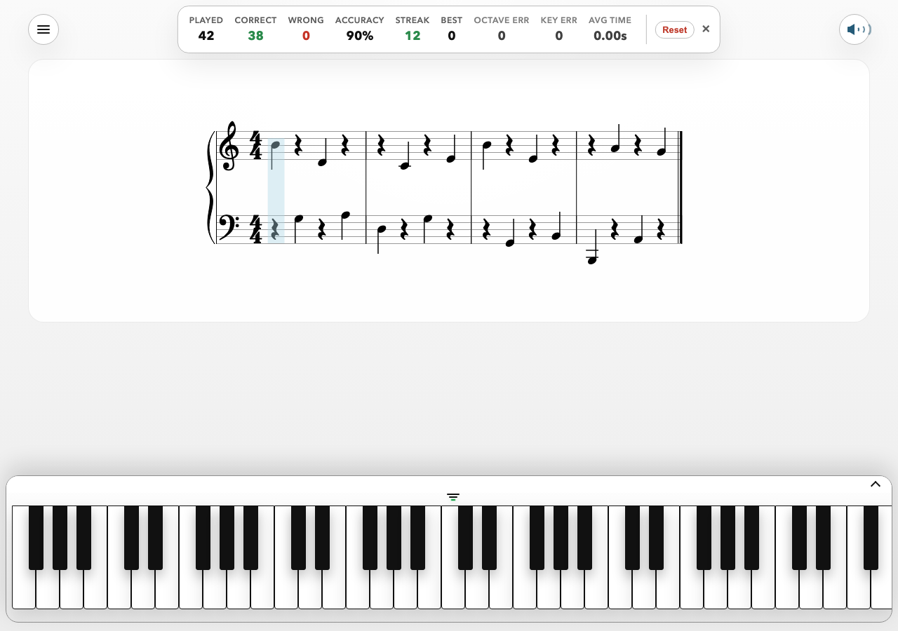
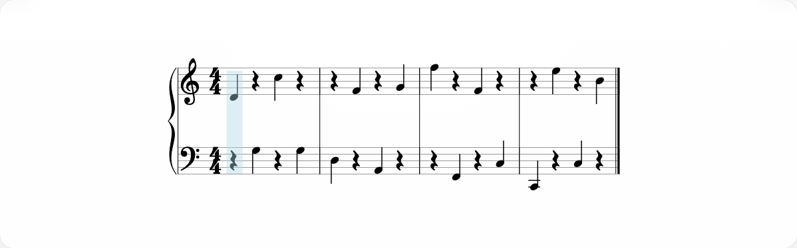
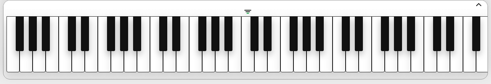
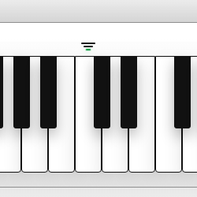
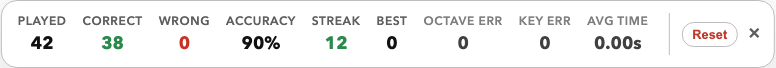
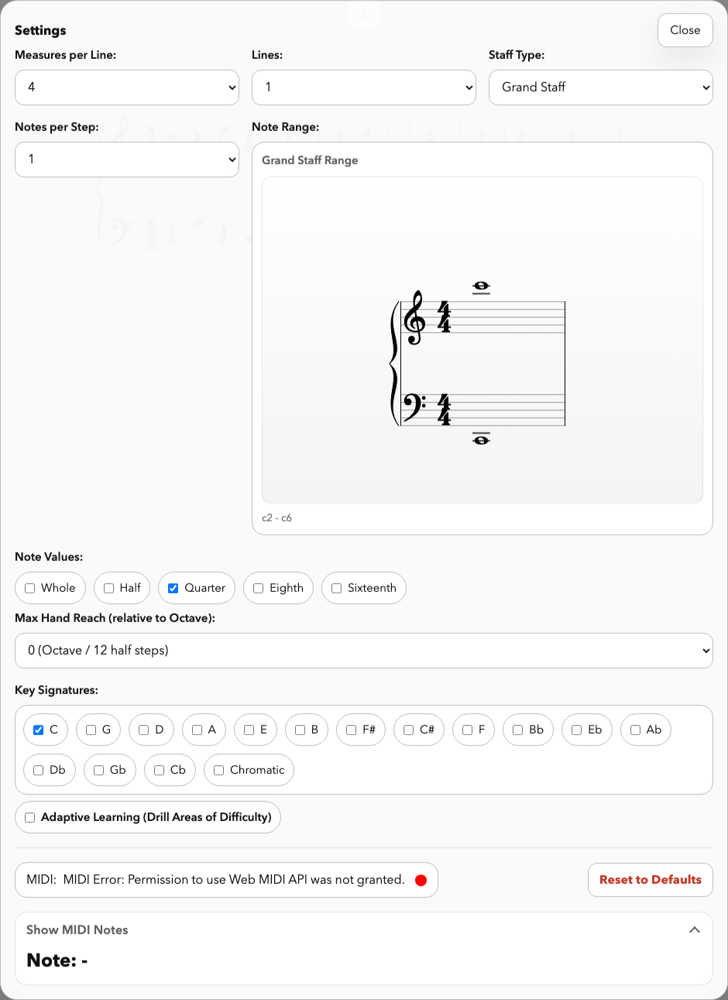
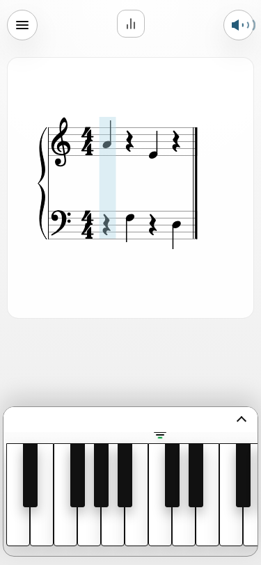

# MIDI Sight Reader - User Guide

Welcome to the **MIDI Sight Reader**! This application is designed to help musicians of all levels improve their sight-reading skills through real-time feedback, dynamic music generation, and intelligent adaptive learning.

---
- This app helped me discover I have to look at my hands too much.
- I have been training with this app to not look at my hands.
- It is often recommended by music teachers to not look at your hands while reading music.
- This is a great tool to learn your way around the keyboard without looking.

- You can tailor this app for one hand or both and increase complexity in many areas at your own pace.

- The one feature I could not find elsewhere that made me write my own: if you select more than one key signature in the settings, the app will randomly rotate through them on new lines of generated music.
- This is teaching me to PAY ATTENTION!

---

## Table of Contents
- [Quick Start](#quick-start)
- [Core Interactive Features](#core-interactive-features)
  - [Visual Feedback & Real-time Scoring](#visual-feedback--real-time-scoring)
  - [On-Screen Piano Keyboard](#on-screen-piano-keyboard)
    - [Keyboard Sizing & Middle C Indicator](#keyboard-sizing--middle-c-indicator)
  - [Audio & Reverb](#audio--reverb)
- [Intelligent Learning](#intelligent-learning)
  - [Adaptive Learning System](#adaptive-learning-system)
  - [Stats & Progress Tracking](#stats--progress-tracking)
- [Customizing Your Practice](#customizing-your-practice)
  - [Score Layout Settings](#score-layout-settings)
  - [Music Generation Settings](#music-generation-settings)
  - [MIDI & Connectivity](#midi--connectivity)
- [Responsiveness](#responsiveness)

---

## Quick Start
1. Connect your MIDI keyboard or use the on-screen keyboard with adaptive and adjustable sizes to practice.
2. Open the application in a WebMIDI-supported browser (like Chrome or Edge).
3. Play the notes shown on the staff. The blue highlight will advance as you play correctly.
4. Adjust settings in the side menu (accessible via the hamburger icon ☰) to match your skill level.

---

## Core Interactive Features

### Visual Feedback & Real-time Scoring
The app provides instant visual feedback to help you correct mistakes as they happen.
- **Beat Highlighting**: A light blue highlight indicates the current notes you need to play.
- **Correct/Wrong Notes**: When you play a note, it appears on the staff. Correct notes advance the piece, while wrong notes are shown in semi-transparent red to help you see the interval error.
- **Hearing Both Notes**: You will hear both the target note and the note you actually played, allowing you to use your ear to correct your hand position.

### On-Screen Piano Keyboard
For those without a MIDI controller or who want a visual reference, the on-screen keyboard can be used to practice. It shows:
- **Real-time Input**: Keys light up as you play (via MIDI, mouse, or touch).
- **Practice Mode**: Use the on-screen keys to play the notes on the staff, allowing you to practice even without external hardware.
- **Correct/Incorrect Cues**: Keys flash green for correct notes and red for incorrect ones.
- **Responsiveness**: The keyboard scales perfectly from mobile phones to large desktop monitors.

### Keyboard Sizing & Middle C Indicator
The on-screen keyboard is designed to be flexible for different screen sizes and preferences.
- **Middle C Indicator**: A small green marker (three horizontal dashes) is located above Middle C (C4). This serves as a quick visual reference point for your hands.
- **Adjustable Sizes**: Click the **Middle C Indicator** to cycle through three different keyboard sizes:
  - **Large**: Best for touch devices and precise clicking.
  - **Medium**: A balanced size for laptop screens.
  - **Small**: Compact view for maximum score visibility.
- **Persistent Settings**: The app remembers your preferred keyboard size between sessions.

### Audio & Reverb
Enhance your practice experience with high-quality synthesized sound.
- **Sound Toggle**: Click the speaker icon in the toolbar to toggle sound.
- **Reverb Feature**: The default sound mode includes a rich **reverb** that simulates a concert hall, making practice more enjoyable and natural-sounding.

---

## Intelligent Learning

### Adaptive Learning System
The "Adaptive Learning" toggle enables an intelligent engine that identifies your weak spots.
- **Trouble Weights**: Every mistake you make increases the "trouble weight" for that specific note, octave, and key signature.
- **Targeted Practice**: The generator uses these weights to ensure difficult areas appear more frequently until you master them.
- **Natural Decay**: As you play notes correctly, their trouble weights decrease, eventually returning the music distribution to normal.

### Stats & Progress Tracking
Track your accuracy and speed over time. Open the stats panel by clicking the bar chart icon 📊.
- **Accuracy & Streaks**: View your total notes played, percentage correct, and your longest consecutive streak.
- **Error Analysis**: See specific counts for octave errors and key signature misses.
- **Session Reset**: Click "Reset" to clear your stats and reset the Adaptive Learning weights for a fresh start.

---

## Customizing Your Practice

All practice settings are found in the **Settings Window**.

### Score Layout Settings
- **Measures per Line**: 1 to 8. Fewer measures make the notes larger and easier to read.
- **Lines**: Display up to 10 lines of music at once.
- **Staff Type**: Choose between **Grand Staff** (Piano), **Treble Clef**, or **Bass Clef**.

### Music Generation Settings
- **Notes per Step**: Set to 1 for melody practice, or up to 10 for complex chord practice.
- **Note Range**: Click and drag on the visual range selector to set the pitch boundaries.
- **Max Hand Reach**: Limits the distance between the lowest and highest note in a chord to ensure it's physically playable for your hand size.
- **Note Values**: Toggle Whole, Half, Quarter, Eighth, and Sixteenth notes to practice different rhythms.
- **Key Signatures**: Select which keys the generator should cycle through.

### MIDI & Connectivity
- **Device Status**: The bottom of the settings panel shows your current MIDI device name and connection status (Green = Connected, Red = Disconnected).
- **Show MIDI Notes**: Expand this section to see a raw text readout of the MIDI notes the app is receiving.

---

## Responsiveness
The MIDI Sight Reader is built with a "mobile-first" responsive design. Whether you are using a smartphone at your piano or a 4K monitor on your desk, the interface adjusts to provide the best reading experience.

[⬆️ Back to Top](#table-of-contents)

---
[⬅️ Back to Home](./README.md)
